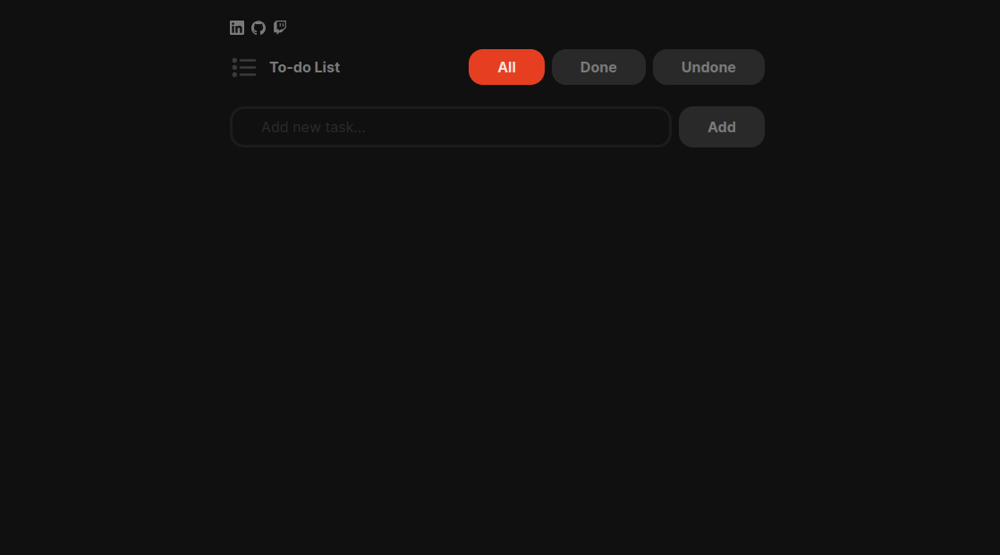

# To-do usando Vue 3 + Vite + TailwindCSS

🇧🇷 Este projeto básico criado com Vue.js foi desenvolvido para fins de aprendizado. Admito que enfrentei algumas dificuldades na aplicação e comunicação entre os componentes, mas acredito que meu desempenho irá melhorar conforme prosseguir com os estudos.

🇺🇸 This basic project created with Vue.js was developed for learning purposes. I admit I faced some challenges in the application and communication between the components, but I believe my performance will improve as I continue with my studies.

## Recommended IDE Setup

- [VS Code](https://code.visualstudio.com/) + [Vue - Official](https://marketplace.visualstudio.com/items?itemName=Vue.volar) (previously Volar) and disable Vetur
